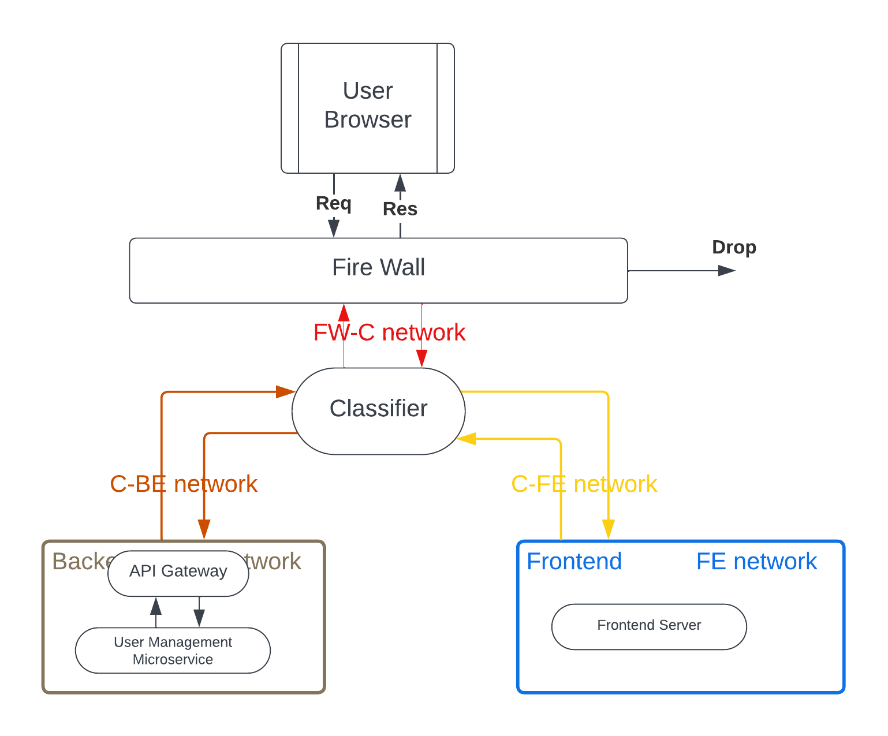
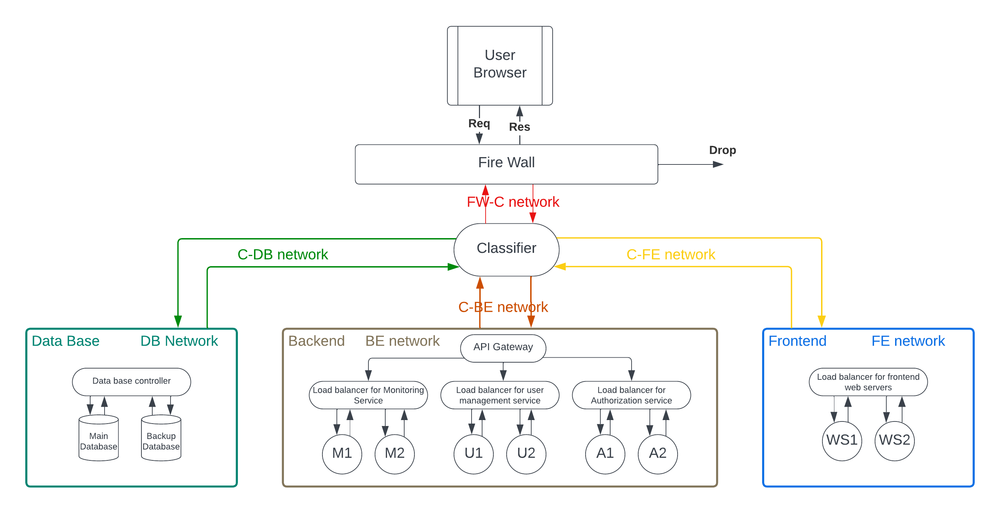

# Welcome to Dockerized Service Function Chaining

## Overview

This repository provides a simplified architecture for Service Function Chaining using Docker containers.


The architecture consists of two principal chains:

### First Chain
#### Firewall - Classifier - Frontend
The Firewall listens for HTTP connections on the address 172.0.0.2. Requests flow through the classifier to the frontend container, and responses are sent back to the firewall to present the user interface.

### Second Chain
#### Frontend - Classifier - Api gateway - User Management Microservice
The classifier controls communication between the frontend and backend. The frontend server makes HTTP requests to the classifier, redirecting them to the API gateway, which identifies the requested microservice.

**Note:** The architecture can be extended by adding additional microservices, load balancers, and database servers for each microservice.


## Prerequisites
Running this project requires installing Docker and Docker Compose on your system.

- [Docker](https://www.docker.com/get-started)
- [Docker Compose](https://docs.docker.com/compose/install/)

## Getting Started
1. Clone the repository:
    ```bash
    git clone https://github.com/gara2000/dockerized-sfc.git
    cd dockerized-sfc
    ```

2. Build the Docker images:
    ```bash
    chmod +x build.sh
    ./build.sh
    ```

3. Start the containers:
    ```bash
    chmod +x run.sh
    ./run.sh
    ```

4. Access the user interface:
    Visit http://172.0.0.2 to access the user interface.

5. Stop the containers:
    ```bash
    chmod +x stop.sh # Run this once
    ./stop.sh
    ```

6. Cleaning Up:
    ```bash
    chmod +x clean.sh # Run this once
    ./clean.sh
    ```

## License
This project is licensed under the GNU GENERAL PUBLIC LICENSE, Version 3, 29 June 2007.

## Reference
The user table (displayed on the user interface) styles have been obtained from this [project](https://codepen.io/bartaxyz/pen/DZJwQX).
